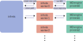

# Running `infretis`

This page is a short guide for people who run `infretis` and want to understand
what the program is doing, where the important output appears, and where the
main source files live.

At runtime, `infretis` reads an `infretis.toml` file, loads initial path
trajectories, creates MD engine objects, and finally runs Monte Carlo
path moves in parallel worker processes.

## How to Run

From a run directory containing an `infretis.toml` input file, initial path
trajectories, and the input files needed by the selected MD engine, run:

```bash
infretisrun -i infretis.toml
```

The command writes runtime output such as `sim.log`, `worker*.log`,
`worker*/`, `restart.toml`, and `infretis_data.txt`. These files are the main
way to follow what happened during a simulation.

The initial paths can be prepared separately, for example from an `infinit`
run. See the [Inf-init background](../background/inf_init.md) and the
`inftools` documentation for more on that workflow.

## Simulation Output

Each MC step follows the same broad pattern: `infretis` chooses a path and an
ensemble, sends that job to a worker, runs a shooting or Wire Fencing move with
the selected MD engine, then records whether the trial path was accepted. The
live path ensemble is updated after completed moves, and enough state is
written to disk that the run can be restarted.

## `sim.log`

Start with `sim.log`. This is the main run log and usually the best file for
understanding what happened. It records which path and ensemble were selected,
which worker ran the move, whether the move was accepted, the new path number,
path length, order-parameter range, timing, and periodic snapshots of the live
path/ensemble state.

For example, a completed move can look like this:

```text
[INFO]: ------- infinity     1 START -------
[INFO]: date: 2026.06.22 00:06:34
[INFO]: shooted wf in ensembles: 004 with paths: 5 =) 8
[INFO]: with status: ACC len: 65 op: [-1.0132 -0.5513] and
[INFO]: worker: 0 total time:1.09s and subcycles: 166
[INFO]: ===
[INFO]:  xx |   v Ensemble numbers v
[INFO]:  xx |   0 0 0 0 0 0 0 0
[INFO]:  xx |   0 0 0 0 0 0 0 0
[INFO]:  xx |   0 1 2 3 4 5 6 7         max_op  min_op  len
[INFO]:  -- |   ----------------------------------------------
[INFO]: p00 |   - - - - - - - - |
[INFO]: p03 |   - - - - - - - - |
[INFO]: p01 |   - - - - - - - - |
[INFO]: p02 |   - - - x - - - - |       -0.664  -1.007      9
[INFO]: p08 |   - - - - x - - - |       -0.551  -1.013     65
[INFO]: p04 |   - - - - - x - - |       -0.493  -1.007     13
[INFO]: p06 |   - - - - - - x - |       -0.279  -1.007     18
[INFO]: p07 |   - - - - - - - - |
[INFO]: ===
[INFO]: shooting wf in ensembles: 005 with paths: 4 and worker: 0
[INFO]: date: 2026.06.22 00:06:35
[INFO]: ------- infinity     1 END -------
```

The `START` and `END` lines bracket what `infretis` printed while processing
MC step 1. The first `date` line is the time at which this step was handled.

The `shooted` line is the result returned by a worker. Here, a Wire Fencing
move (`wf`) was run in ensemble `004`. The notation `paths: 5 =) 8` means that
path `5` was used as input and path `8` was produced as the accepted trial
path. The next line gives the move status, path length, and order-parameter
range: `ACC` means accepted, `len: 65` is the number of phase points in the new
path, and `op: [-1.0132 -0.5513]` is the minimum and maximum order parameter
seen along that path. The worker line says that worker `0` completed the move
in `1.09s` using `166` MD subcycles.

The grid between the two `===` lines is a snapshot of the live path ensemble
after the completed move was processed. Rows are path numbers, written as
`p00`, `p03`, and so on. Columns are ensemble numbers, here `0` through `7`.

==
Explain grid 

==

The rightmost columns give `max_op`, `min_op`, and `len` for paths
that are currently active in an ensemble. Rows without those values are not
active in the printed live ensemble snapshot.

After the grid, `infretis` immediately schedules more work if a worker is
available. The line `shooting wf in ensembles: 005 with paths: 4 and worker: 0`
is therefore the next submitted job, not the result of step 1. Its result will
appear later as another `shooted ...` line when worker `0` returns. The final
`date` and `END` lines close the logging block for this MC step.

Each `worker*/` directory is a scratch directory for one worker. It contains
engine input/output files generated during propagation, for example temporary
configuration files, backward/forward trajectory fragments such as
`*_trajB.*` and `*_trajF.*`, generated-velocity files, and `msg-*` files with
engine-level propagation traces. These directories are mainly useful for
debugging engine behavior, not for a first-pass analysis.

## `infretis_data.txt`

`infretis_data.txt` is the compact per-step summary. The first columns give the
new path number, path length, and maximum order parameter. The remaining
ensemble columns summarize how the path contributes to the interface ensembles;
`----` means no contribution for that entry. This file is the most convenient
starting point for plotting path lengths, maximum order parameters, and
ensemble statistics over the run.

## `restart.toml`

`restart.toml` is the restartable state of the simulation. It contains the
original `infretis.toml` settings plus additional parameters generated during
the run. The most important addition is the `[current]` section, which stores
the current MC step, active path numbers, live locks, worker subcycle counts,
and RNG state.

`infretis` is designed so that a restart looks almost like starting from the
beginning: the input file is still a TOML configuration file, but it now
contains the extra state needed to continue rather than reinitialize the
simulation.

## Path Output

Accepted paths are stored under the configured path directory, commonly
`load/<path_number>/` after a run. A path directory usually contains:

| File | Meaning |
| --- | --- |
| `traj.txt` | Frame-by-frame references to trajectory files, frame indices, and velocity direction |
| `order.txt` | Order-parameter values along the accepted path |
| `energy.txt` | Energies and temperature along the path, when available from the engine |

The exact retained engine trajectory files depend on the engine and output
settings such as `delete_old`, `delete_old_all`, `keep_traj_fnames`, and
`keep_status`.

## Source Code Layout

Most users do not need to read the source code to run `infretis`, but the
following map can help connect output files and runtime behavior to the
implementation.

```text
infretis/
├── infretis/
│   ├── bin.py                  # CLI entry point: infretisrun
│   ├── setup.py                # TOML loading, defaults, validation, logging
│   ├── scheduler.py            # Main simulation loop
│   ├── asyncrunner.py          # Worker execution helper
│   ├── core/
│   │   ├── core.py             # Factories, dynamic imports, small helpers
│   │   └── tis.py              # TIS/RETIS moves and the worker task
│   └── classes/
│       ├── repex.py            # REPEX state and infinite-swap probabilities
│       ├── path.py             # Path object and trajectory utilities
│       ├── system.py           # One phase point / snapshot
│       ├── orderparameter.py   # Built-in and external order parameters
│       ├── formatter.py        # Path, order, energy, and output file I/O
│       └── engines/            # GROMACS, LAMMPS, CP2K, ASE, etc.
├── examples/                   # Example inputs and run directories
├── test/                       # Tests grouped by subsystem
└── pyproject.toml              # Package metadata and tooling
```

## Main Run Path

1. `infretis/bin.py` parses `infretisrun -i input.toml`.
2. `infretis/setup.py` reads and validates TOML, fills defaults, sets up
   logging, loads paths, and creates the initial `REPEX_state`.
3. `infretis/scheduler.py` starts the runner, submits initial jobs, consumes
   finished worker results, and submits new jobs until the requested number of
   MC steps is reached.
4. `infretis/classes/repex.py` chooses the next path/ensemble pair and updates
   live paths, output, and restart data after each completed move.
5. `infretis/core/tis.py` runs the actual path move in each worker through
   `run_md()`.

For the full execution flow, read:

```text
bin.py -> setup.py -> scheduler.py -> classes/repex.py -> core/tis.py
```

`asyncrunner.py` is mostly infrastructure for executing worker jobs. Most users
do not need to read it unless they are debugging worker parallelization behavior.

For path data structures, read `classes/system.py`, `classes/path.py`, and the
path-related parts of `classes/formatter.py`.

For engine development, read `classes/engines/enginebase.py`,
`classes/engines/factory.py`, then compare `ase_engine.py` with one external
engine such as `gromacs.py` or `lammps.py`.

For order parameters, read `classes/orderparameter.py` and the `orderp.py`
files under `examples/`.

## External ASE engine
Running infretis with the external ASE engine (currently on the `external_ase`
branch of infretis) differ from all other infretis engines. The main difference
is that the workers performing the MD integration are launched as
subprocesses, as illustrate below:

```bash
python -m infretis.classes.engines.propagator infretis.toml worker0 &
python -m infretis.classes.engines.propagator infretis.toml worker1 &
python -m infretis.classes.engines.propagator infretis.toml worker2 &
infretisrun -i infretis.toml
```

This launches 3 infretis engine background processes using the `propagator.py`
script. This script sets up the engine and the orderparameter, and then waits
for further commands. Therafter, the main infretis process is launched, which
sets up 3 infretis workers.

Infretis tells each infretis worker to create a new path in some ensemble. The
creation of a path requires MD, so the infretis worker instructs the engine
background process to run MD from some initial condition. The infretis worker
achieves this by writing an `INFINITY_START` text file in the worker directory,
which the engine process is waiting for to appear. The engine process reads
this file, which defines things like the file path of the initial
configuration, the stopping conditions for the path, etc. The engine process
then runs MD with this information, and when the the engine process is done
with the MD propagation, writes the output to files, which the infretis worker
then reads and processes. Thereafter, the infretis worker might instruct the
engine process to generate another MD trajectory, until the path is completed.
The infretis worker then reports back to the main infretis process, during
which the engine process waits for the next instructions from an infretis
worker. This is illustrated in the figure below:

<figure> 
<figcaption>
The interactions between infretis and the background MD engines processes with the `external_ase` engine.
</figcaption></figure>

The `external_ase` engine allows one to easily integrate custom engines that
supporting running MD via a python interface, such as OpenMM or LAMMPS.
However, it was initially added to infretis to reduce the overhead of loading
machine-learned potentials each time an MD propagation is performed, so it
works out of the box only with ASE calculators. For other MD softwares, one has
to implement a custom ASE calculator. This is illustrated for OpenMM on
[infentory/openmm_examples](https://github.com/infretis/infentory/tree/main/openmm_examples/).
